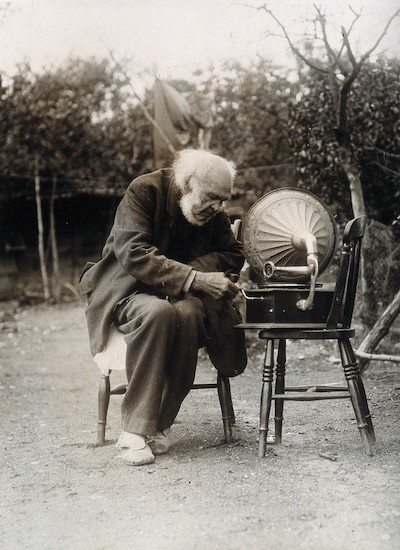

# overcast-downloader

This is a script that lets you download the audio files for every podcast you've listened to in Overcast.

I listen to a lot of podcasts, and I use [Overcast].
Sometimes I want to listen to a podcast I heard a long time ago, but links rot, websites break, and episodes go offline.
This script allows me to download the audio file of every episode I've listened to, so I have a local archive of podcast episodes.

[Overcast]: https://overcast.fm/



*Podcasts have a richer sound when you listen to them on vinyl. Image credit: <a href="https://wellcomecollection.org/works/n7cthawx">Wellcome Collection</a>. CC BY.*


## Background

This is something I've wanted for a while (at least two podcasts I loved have completely disappeared from the web), but I was never sure how to do it.
In a segment in [ATP episode 353][atp353], Marco mentioned an export with a list of every episode you'd ever listened to:

> I can tell you what Overcast saves in the database table that saves your episode progress, which is by far my biggest database table.
> It saves, for each episode you've interacted with, the current timestamp, and whether it's been completed. […]
>
> If you go to the account section of the website, you can export OPML -- a custom, extended format that I implemented -- so you can actually export all your data. […]
> I can tell you a list of episodes you've completed, or played in some way in Overcast.

I went digging, and it was exactly what I wanted -- and shortly after, I had a script that downloads every MP3 it refers to.

[atp353]: https://overcast.fm/+R7DWLpsnY/1:40:21


## How to use this script

You need:

*   **An Overcast account with an email and password.**
    You can create this in the Overcast iOS app.
    If you haven't done this before, or you've forgotten your email/password, read [my instructions](add_email_password) for doing so.

*   **A working Python 3 installation.**
    This script only works with Python 3.
    You need to install dependencies with pip:

    ```console
    $ pip3 install -r requirements.txt
    ```

Steps:

1.  **Get your Overcast OPML file.**

    Log in to the Overcast website at <https://overcast.fm/login> using your email address and password.

    Once you're logged in, navigate to <https://overcast.fm/account>.
    Under "Export Your Data", click "All data".
    This will download an OPML file, which includes a list of every podcast episode you've ever played.

2.  **Download the Python script.**

    Download the script [`download_overcast_podcasts.py`](download_overcast_podcasts.py), and save it somewhere on your disk.

3.  **Run the script, passing the path to your OPML file as the first argument.**
    For example, if the OPML file is in `~/Downloads/overcast.opml.xml`, run:

    ```console
    $ python download_overcast_podcasts.py ~/Downloads/overcast.opml.xml
    ```

    This will start downloading the audio files to a folder called `audiofiles`.
    If you'd like to save them somewhere different, pass the `--download_dir` flag.
    For example, if you wanted to save the files to `~/Documents/podcasts`, run:

    ```console
    $ python download_overcast_podcasts.py ~/Downloads/overcast.opml.xml --out_dir ~/Documents/podcasts
    ```

The initial download will be very slow, depending on how many podcasts you've listened to, and it uses a lot of disk space.
(At time of writing, I have ~2500 episodes in my export, which take up 61 GB.)
On subsequent runs, the script should only download files that it hasn't saved before, so it should be a lot faster.


## License

MIT.
