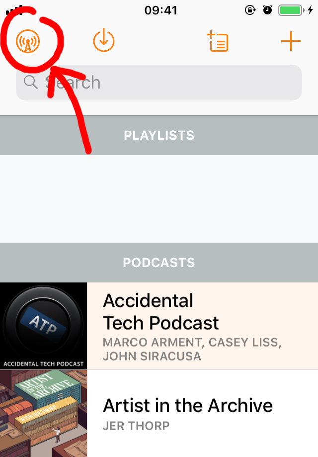
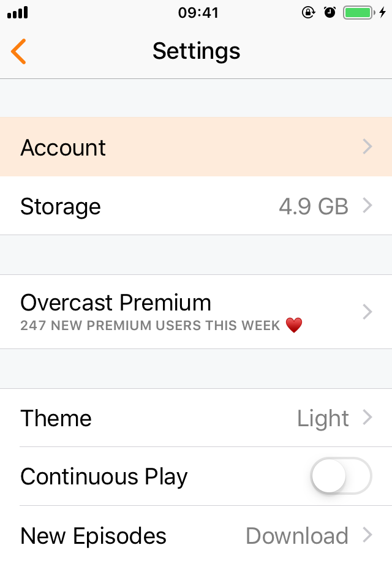
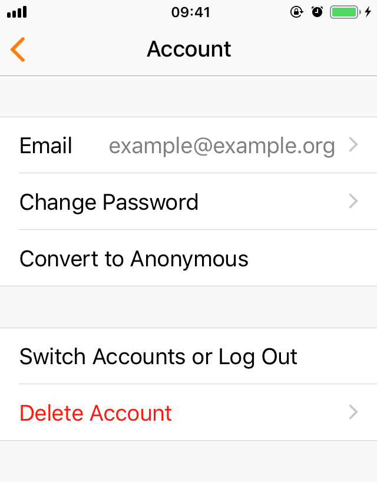
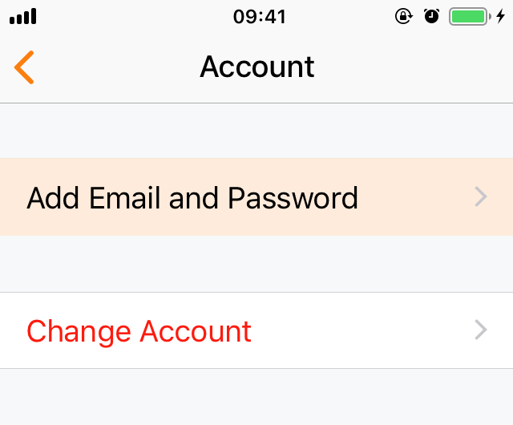
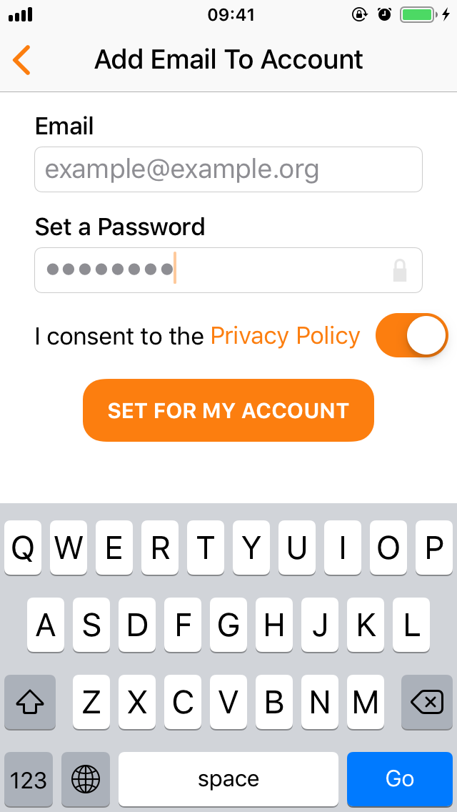

# Create a username/password for your account

1.  In the iOS app, tap the icon in the top left-hand corner to open the settings screen.

    

2.  Tap "Account" to enter the account settings.

    

3.  If you already have an email/password set up, you'll see the email at the top of the account settings:

    

    If you remember your password, you're done!
    If not, tap "Change Password" to set a new password.

    If you don't have an email and password set up, tap "Add Email and Password":

    

4.  Enter your email address and set a password for your account:

    .
